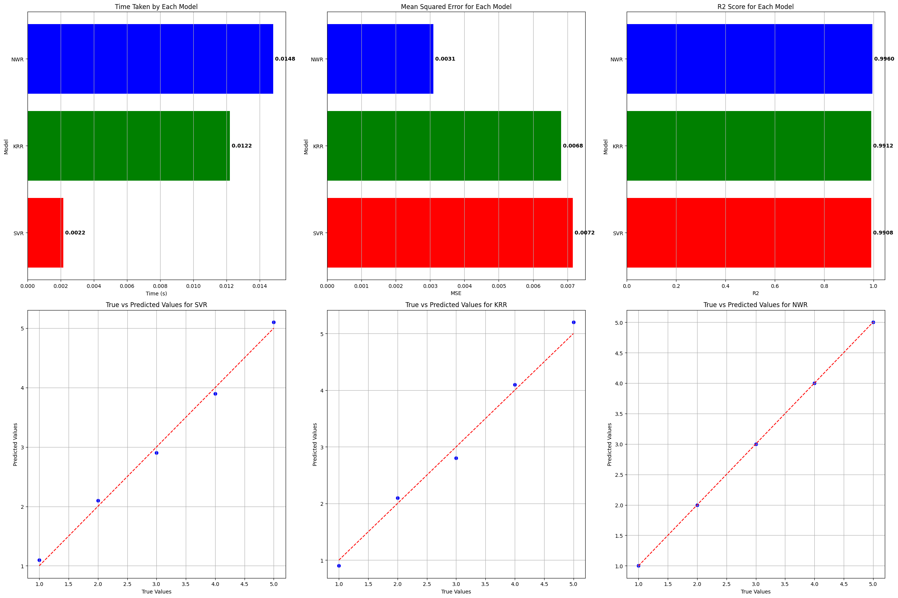
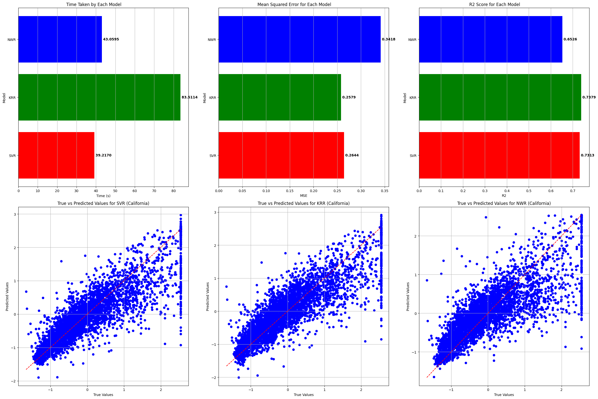
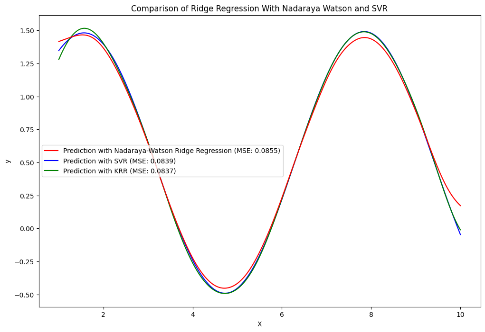

# Nadaraya-Watson Ridge Regression: Advanced Machine Learning Model

## Overview

The Nadaraya-Watson Ridge Regression library combines the robustness of Ridge Regression with the flexibility of Nadaraya-Watson kernel smoothing. This hybrid approach offers a robust solution for non-linear regression problems, overcoming the limitations of traditional ridge regression models.

### Key Features

- **Ridge Regression**: Tackle overfitting problems by introducing an L2 regularization term.
- **Nadaraya-Watson Kernel Smoothing**: Non-linear mapping of input features to labels.
- **Custom Kernel Support**: Use predefined or custom kernel functions.
- **Sparse Data Compatible**: Built to handle sparse data efficiently.
- **Concurrency**: Utilizes multi-threading for large datasets to expedite computation.

## Table of Contents

1. [Requirements](#requirements)
2. [Installation](#installation)
3. [Usage](#usage)
    - [Simple Example](#simple-example)
    - [Advanced Usage](#advanced-usage)
4. [Performance Comparison](#performance-comparison)
    - [Bicycle-Counts Dataset](#bicycle-counts-dataset)
    - [California Housing Dataset](#california-housing-dataset)
    - [Synthetic Dataset](#synthetic-dataset)

## Requirements

### Software

- Python 3.x

### Python Packages

- NumPy
- SciPy

## Installation

To get started with the Nadaraya-Watson Ridge Regression library, follow these steps:

1. Clone this repository:

    ```bash
    git clone https://github.com/guyfloki/Nadaraya-Watson-Ridge-Regression.git
    cd Nadaraya-Watson-Ridge-Regression
    ```

2. Install required Python packages:

    ```bash
    pip install numpy scipy
    pip install numpy numpy
    ```

## Usage

### Simple Example

Here's how you can quickly get started:

```python
from nw_ridge_regression import NadarayaWatsonRidgeRegression
import numpy as np

# Create training and test datasets
X_train = np.random.rand(100, 2)
y_train = np.sin(X_train[:, 0]) + np.cos(X_train[:, 1])
X_test = np.random.rand(10, 2)

# Initialize and fit the model
model = NadarayaWatsonRidgeRegression(alpha=1.0, h=0.5)
model.fit(X_train, y_train)

# Make predictions
y_pred = model.predict(X_test)
```

### Advanced Usage

This library offers several advanced features:

- **Custom Kernel Functions**: You can pass a custom kernel function when initializing the model.
- **Weight Decay in AdamW Optimizer**: The AdamW optimizer supports weight decay, offering better generalization in some cases.
- **Thread Pooling for Large Datasets**: The model employs a thread pool to compute the Nadaraya-Watson estimator for large datasets.

## Performance Comparison

We have conducted performance tests on various datasets to compare Nadaraya-Watson Ridge Regression (NWRR) with Support Vector Regression (SVR) and Kernel Ridge Regression (KRR). The results are summarized below:

### Bicycle-Counts Dataset



### California Housing Dataset



### Synthetic Dataset



